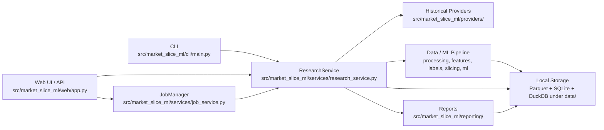
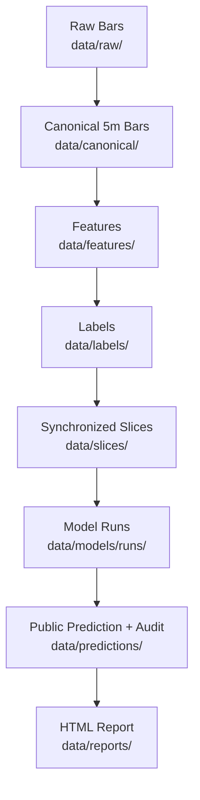
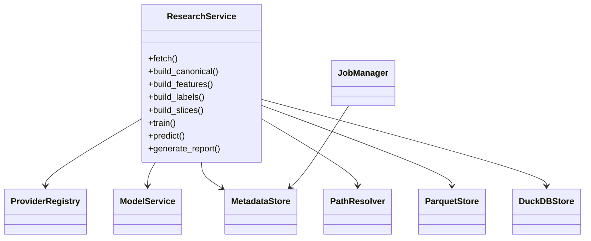

# Market Slice ML Platform

## 專案概述

Market Slice ML Platform 是個人美股與多資產市場研究平台。核心流程以本機資料為中心，將歷史 Bars 或 deterministic synthetic fixtures 轉成 Canonical 5m Bars、Features、Labels、synchronized Slices、Model artifacts、六欄 Prediction 與 self-contained HTML Report。

此專案的執行邊界是研究與驗證。程式碼保留 Historical Provider 介面、離線 smoke pipeline、CLI、Web UI 與測試工具；排除下單、券商帳戶讀取、部位管理、即時交易迴圈與投資建議輸出。

更多細節：

- [docs/architecture.md](docs/architecture.md)
- [docs/testing.md](docs/testing.md)
- [docs/known_limitations.md](docs/known_limitations.md)

## 功能範圍

已實作並驗證的範圍：

- 本機優先（local-first）的 CLI 與 Web UI。
- `NO_NETWORK=1` 預設離線模式；測試不得呼叫 live Provider。
- deterministic synthetic smoke pipeline：產生固定資料、訓練小型模型並輸出 HTML Report。
- Canonical 5m Bars、Feature builder、Label builder、synchronized Slice builder。
- Tree / LSTM / GNN fallback Model 流程；PyG acceleration 為 optional。
- Ensemble Prediction，公開輸出固定六欄：
  - `symbol`
  - `horizon`
  - `direction`
  - `expected_return`
  - `expected_volatility`
  - `confidence_score`
- self-contained HTML Report，不依賴 CDN。
- FastAPI Web UI，預設只綁定 `127.0.0.1`。
- SQLite Job metadata、Parquet data files、DuckDB read path。
- no-trading static guard。

目前排除的範圍：

- 下單、帳戶、部位、entry / exit、stop loss、take profit、buy / sell / hold signal。
- 保證 live Provider 可用；Provider 需在 `NO_NETWORK=0` 且環境設定完成後個別驗證。
- GPU / CUDA / PyG acceleration 必備條件。
- Docker image build 已修正 build context，但尚未在目前環境完整完成。

## 目錄結構

```text
configs/                     YAML 設定檔
docs/                        架構、測試與限制文件
scripts/                     安裝、診斷、檢查與 smoke pipeline 腳本
src/market_slice_ml/cli/     Typer CLI
src/market_slice_ml/web/     FastAPI Web UI、templates、static assets
src/market_slice_ml/services/CLI/Web 共用服務層
src/market_slice_ml/providers/ Historical Provider adapters 與 disabled scaffolds
src/market_slice_ml/processing/ Canonical Bars 建立與資料清理
src/market_slice_ml/features/ Feature builders
src/market_slice_ml/labels/  Label builders
src/market_slice_ml/slicing/ synchronized Slice builders
src/market_slice_ml/ml/      Tree、LSTM、GNN fallback、ensemble、evaluation
src/market_slice_ml/reporting/ HTML 與 CLI Report
src/market_slice_ml/storage/ Parquet、SQLite metadata、DuckDB helpers
tests/                       unit/property/integration/e2e tests
data/                        本機執行產物，預設不納入 Docker build context
```

## 系統架構（System Architecture）



此圖對應 `src/market_slice_ml/cli/main.py`、`src/market_slice_ml/web/app.py`、`src/market_slice_ml/services/research_service.py`、`src/market_slice_ml/services/job_service.py` 與 `src/market_slice_ml/storage/`。CLI 與 Web UI 共用 `ResearchService`，長操作由 Web API 透過 `JobManager` 排入單一背景 worker。

## 資料流（Data Flow）



此圖對應 `ResearchService.fetch()`、`build_canonical()`、`build_features()`、`build_labels()`、`build_slices()`、`train()`、`predict()` 與 `generate_report()`。所有內部 timestamp 使用 timezone-aware UTC；美股 session 判斷使用 `America/New_York`。

## 模組關係（Module Relationship）



此圖對應 `src/market_slice_ml/services/` 與 `src/market_slice_ml/storage/`。`ResearchService` 負責協調資料讀寫、Provider、pipeline 與 Model；`ModelService` 負責 train / predict；`JobManager` 負責 Web UI 背景 Job 狀態。

## 建置流程（Build Process）

### 必要環境

- Ubuntu 24.04 LTS 優先；Ubuntu 22.04 可使用，但必須能提供 Python 3.12。
- Python `>=3.12,<3.13`。
- `.venv` 作為 package isolation。
- CPU baseline 必須可用；CUDA、PyG、IBKR、AKShare、Alpha Vantage、Schwab 都是 optional。

### 相依套件安裝方式

```bash
python3.12 -m venv .venv
source .venv/bin/activate
python -m pip install --upgrade pip wheel "setuptools<82"
python -m pip install -e ".[dev]"
python -m pip install torch --index-url https://download.pytorch.org/whl/cpu
```

使用 `"setuptools<82"` 是為了避免目前 CPU Torch wheel 對 `setuptools` 的版本限制造成 dependency conflict。

### 建置指令

本專案是 Python package；主要建置動作是 editable install 與檢查 console script 是否可用：

```bash
source .venv/bin/activate
market-ml --help
```

也可以使用專案既有 wrapper：

```bash
make setup
make checks
```

### 建置產物位置

- `.venv/`：Python virtual environment 與 console script。
- `src/market_slice_ml.egg-info/` 或對應 editable metadata：editable install 產物。
- `data/diagnostics/latest_env_report.json`：診斷腳本輸出。
- `data/reports/smoke_report.html`：smoke pipeline HTML Report。

### 建置成功時的英文輸出範例

```text
Successfully installed market-slice-ml-platform-1.0.0
Usage: market-ml [OPTIONS] COMMAND [ARGS]...
All checks passed.
```

## 執行流程（Run Process）

### 執行前準備

```bash
cp .env.example .env
source .venv/bin/activate
```

預設 `.env.example` 設定 `NO_NETWORK=1`，因此 live Provider request 不會執行。

### CLI 執行指令

```bash
market-ml status
market-ml probe
```

常用 pipeline 指令如下。這些指令需要前一階段資料已存在；若資料不足，CLI 會回傳原因與下一步。

```bash
market-ml fetch --start 2022-01-01
market-ml build-canonical
market-ml build-features
market-ml build-labels
market-ml slices build
market-ml slices list
market-ml train --all-pairs --horizon all
market-ml predict --symbol NQ=F --horizon h1
market-ml report --out data/reports/latest.html
```

### Web UI 執行指令

```bash
market-ml web
```

開啟 `http://127.0.0.1:8000`。若要綁定非本機 host，必須設定 `WEB_API_TOKEN`，API 使用 `X-API-Token` 驗證。

### 執行成功時的英文輸出範例

```text
Uvicorn running on http://127.0.0.1:8000
Smoke pipeline passed: data/reports/smoke_report.html
All checks passed.
```

### 停止服務或清理方式

- CLI 指令執行完會自行結束。
- Web UI 使用 `Ctrl+C` 停止。
- Docker Compose 若已啟動：

```bash
docker compose down
```

## Demo 步驟（Demo Steps）

### Demo 前置條件

- `.venv` 已建立並安裝 `.[dev]`。
- `NO_NETWORK=1`。
- 不需要 live Provider credentials。

### Demo 操作步驟

```bash
source .venv/bin/activate
python scripts/smoke_local_pipeline.py
```

### 使用的輸入資料位置

Demo 使用 `src/market_slice_ml/pipeline.py` 內的 deterministic synthetic Bars，不讀取外部檔案，也不連線 live Provider。

### 預期輸出位置

```text
data/reports/smoke_report.html
```

### 預期終端機輸出

```text
Smoke pipeline passed: data/reports/smoke_report.html
```

## 預期結果（Expected Result）

Demo 執行後應觀察到：

- `data/reports/smoke_report.html` 存在。
- HTML Report 不含 `http://`、`https://`、`cdn.`、`cdnjs`、`unpkg`。
- public Prediction schema 仍為六欄。
- `bash scripts/run_all_checks.sh --full` 最後輸出：

```text
All checks passed.
```

若結果不符合預期，優先檢查：

- `.venv/bin/python --version` 是否為 Python 3.12.x。
- 是否已執行 `python -m pip install -e ".[dev]"`。
- `NO_NETWORK` 是否維持 `1`。
- `data/` 是否可寫入。
- `python scripts/doctor.py` 的診斷輸出。

## 設定檔說明

| 檔案 | 用途 |
|---|---|
| `.env.example` | 本機環境變數範例，預設 `NO_NETWORK=1`、`WEB_HOST=127.0.0.1`。 |
| `configs/symbols.yaml` | Target Symbols 與 context Symbols。 |
| `configs/providers.yaml` | Historical Provider enablement 與 priority。 |
| `configs/relationships.yaml` | cross-asset Feature 的靜態關係權重。 |
| `configs/train_val_pairs.yaml` | synchronized Slice 的 train / validation 時間範圍。 |
| `configs/ml.yaml` | Horizons、Feature columns、Tree / LSTM / GNN fallback 參數。 |
| `configs/quality_rules.yaml` | OHLCV quality checks。 |
| `configs/report.yaml` | Report 相關設定。 |
| `configs/slicing.yaml` | Slice 建立設定。 |

## 常見操作或除錯方式

```bash
python scripts/verify_install.py
python scripts/verify_torch_stack.py
python scripts/doctor.py
python scripts/check_data_sources.py
python scripts/check_no_trading_api.py
ruff check src tests scripts
mypy src --ignore-missing-imports
pytest tests/ -q --tb=short
bash scripts/run_all_checks.sh --full
```

常見狀況：

- `python3` 指到 Python 3.10：改用 `python3.12` 建立 `.venv`。
- live Fetch 被拒絕：確認是否仍為 `NO_NETWORK=1`。離線模式下這是預期行為。
- Web API 回傳 token error：非本機 host 或設定 `WEB_API_TOKEN` 時，request header 需提供 `X-API-Token`。
- Prediction unavailable：通常是 Features、Slices 或 Model artifacts 尚未建立。
- Docker build 花費過久：目前 `.dockerignore` 已限制 build context，但首次 build 仍需下載 apt / pip packages 與大型 wheels。

## Docker

```bash
docker compose config
docker compose build
docker compose run --rm app status
```

已驗證 `docker compose config` 可通過。`docker compose build` 在目前環境可開始建置且 build context 約 46KB，但尚未在限定時間內完整產出 image；因此 Docker image 不列為目前 CPU baseline 的通過條件。

## CI/CD

`.github/workflows/ci.yml` 目前在 GitHub Actions Ubuntu runner 上執行：

```bash
python -m pip install --upgrade pip wheel "setuptools<82"
pip install -e ".[dev]"
pip install torch --index-url https://download.pytorch.org/whl/cpu
bash scripts/run_all_checks.sh --full
```

CI 不需要 live Provider secrets；檢查流程使用 `NO_NETWORK=1`。

## 限制與目前未涵蓋範圍

- Host `python3` 可能不是 Python 3.12；目前已驗證的是 `.venv/bin/python` 3.12.13。
- CUDA runtime 未啟用；目前通過的是 CPU Torch baseline。
- PyG acceleration、IBKR Historical、AKShare、Alpha Vantage、Schwab 未在目前環境啟用。
- Live Historical Provider 需個別 credentials、network 與資料區間驗證。
- Docker image build 尚未完整通過。
- 此 workspace 目前不是 Git repository，無法用 Git status / diff 管理變更。
