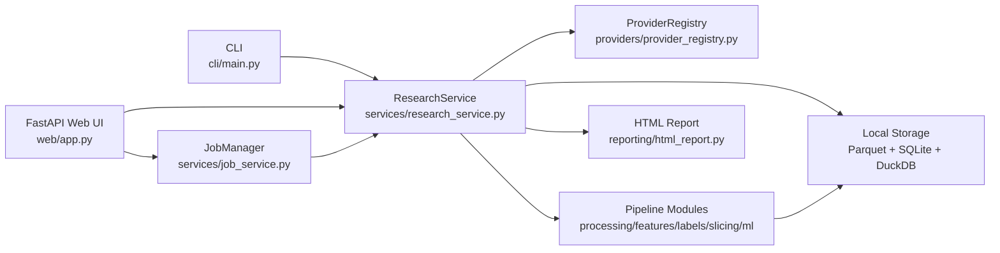
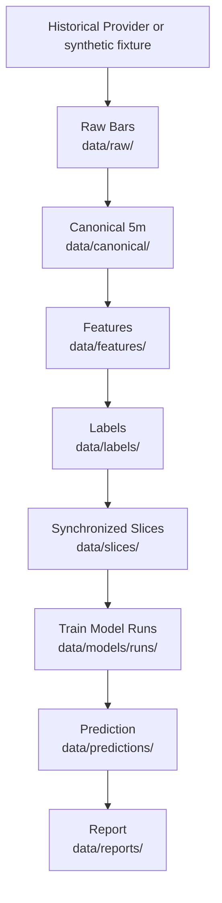
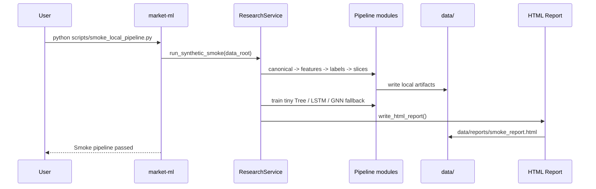
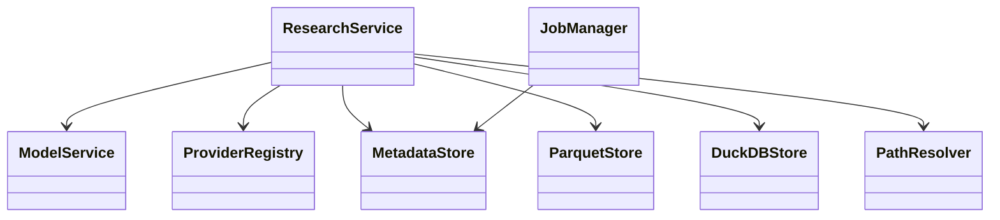

# Architecture

本文記錄 Market Slice ML Platform 目前已實作的架構。描述以程式碼、設定檔與測試可驗證的內容為準。

## System Architecture

對應檔案：`src/market_slice_ml/cli/main.py`、`src/market_slice_ml/web/app.py`、`src/market_slice_ml/services/research_service.py`、`src/market_slice_ml/services/job_service.py`、`src/market_slice_ml/providers/provider_registry.py`、`src/market_slice_ml/reporting/html_report.py`。

## Data Flow

對應流程：`ResearchService.fetch()`、`build_canonical()`、`build_features()`、`build_labels()`、`build_slices()`、`train()`、`predict()`、`generate_report()`。`scripts/smoke_local_pipeline.py` 使用 synthetic fixture 走同一類資料轉換，但不呼叫 live Provider。

## Sequence Diagram

對應檔案：`scripts/smoke_local_pipeline.py`、`src/market_slice_ml/pipeline.py`、`src/market_slice_ml/reporting/html_report.py`。

## Module Relationship

對應檔案：`src/market_slice_ml/services/model_service.py`、`src/market_slice_ml/storage/metadata_store.py`、`src/market_slice_ml/storage/parquet_store.py`、`src/market_slice_ml/storage/duckdb_store.py`、`src/market_slice_ml/storage/path_resolver.py`。
